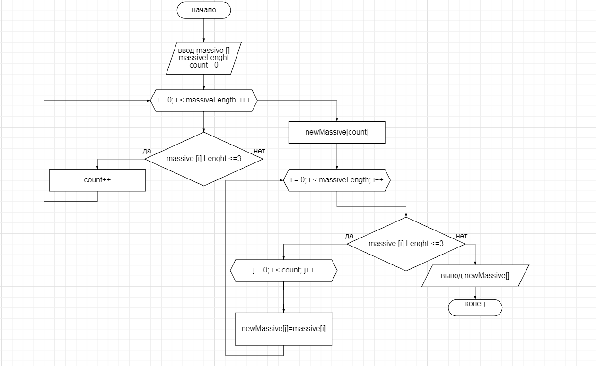

# Итоговая контрольная работа по основному блоку

*Задача* 
Написать программу, которая из имеющегося массива строк формирует новый массив из строк, длина которых меньше, либо равна 3 символам. Первоначальный массив можно ввести с клавиатуры, либо задать на старте выполнения алгоритма. При решении не рекомендуется пользоваться коллекциями, лучше обойтись исключительно массивами.

## Блок-схема алгоритма

## Решение

С помощью консоли необходимо ввести количество элементов массива и каждый элемент массива, в методе **CountElement** происходит проверка, что элементов больше 0. С помощью метода **GenerateMassive** считывается значение каждого элемента и когда массив заполнен, приходит сообщение.
В консоли выводится изначальный массив.

В методе **CountTrueElement** происходит расчет новой длины массива.
Затем происходит проверка, что длина строк *меньше или равна 3*, если новый массив не пустой, то происходит генерация нового массива, с помощью метода **GenerateNewArray** и на экран выводится новый массив, иначе выводится сообщение о том, что все строки длиной больше 3.

